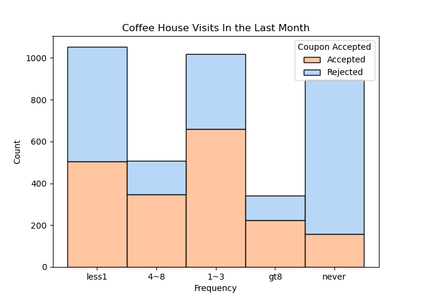
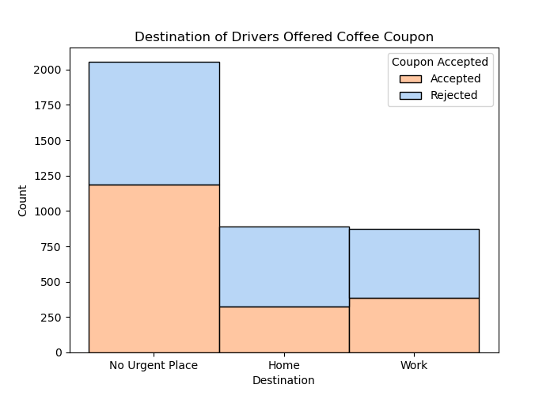
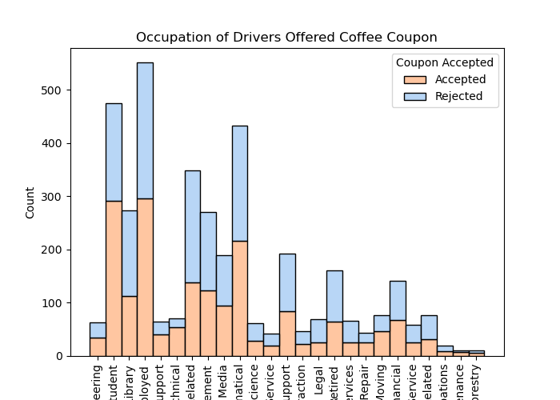

# Will the Customer Accept the Coupon?
**Context**

Imagine driving through town and a coupon is delivered to your cell phone for a restaurant near where you are driving. Would you accept that coupon and take a short detour to the restaurant? Would you accept the coupon but use it on a subsequent trip? Would you ignore the coupon entirely? What if the coupon was for a bar instead of a restaurant? What about a coffee house? Would you accept a bar coupon with a minor passenger in the car? What about if it was just you and your partner in the car? Would weather impact the rate of acceptance? What about the time of day?

Obviously, proximity to the business is a factor on whether the coupon is delivered to the driver or not, but what are the factors that determine whether a driver accepts the coupon once it is delivered to them? How would you determine whether a driver is likely to accept a coupon?

**Overview**

The goal of this project is to use what you know about visualizations and probability distributions to distinguish between customers who accepted a driving coupon versus those that did not.

**Data**

This data comes to us from the UCI Machine Learning repository and was collected via a survey on Amazon Mechanical Turk. The survey describes different driving scenarios including the destination, current time, weather, passenger, etc., and then ask the person whether he will accept the coupon if he is the driver. Answers that the user will drive there ‘right away’ or ‘later before the coupon expires’ are labeled as ‘Y = 1’ and answers ‘no, I do not want the coupon’ are labeled as ‘Y = 0’.  There are five different types of coupons -- less expensive restaurants (under \$20), coffee houses, carry out & take away, bar, and more expensive restaurants (\$20 - $50).

## Findings Summary

For the Coffee coupons group, we want to explore the demographics and conditions that would cause a driver to accept or reject a coupon. 

The following are all factors with higher than the baseline coffee coupon acceptance rate (49.6%).
- Passenger was a Friend (60%)
- Occupation was a Student (61%)
- No urgent destination (58%)
- Previously went to a coffee more than 1 time (66%)

**Recommendation and Action Items**

These factors can be used individually or together for a targeted campaign. 

When combined, a greater acceptance rate was achieved (82%). 

Note: In this chart, it can be seen that individuals who never have visited a coffee shop in the last month are more inclined to reject the coupon.

